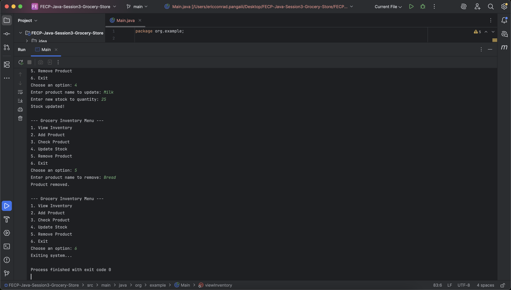

# FECP-Java-Session3-Grocery-Store

## Lab 1: Part 1 of 2 Grocery Store Inventory System

## Eric Conrad Panga

## Screenshots of Output

### addProduct

### checkProduct

### updateProduct

### removeProduct

### viewInventory

### Exit
